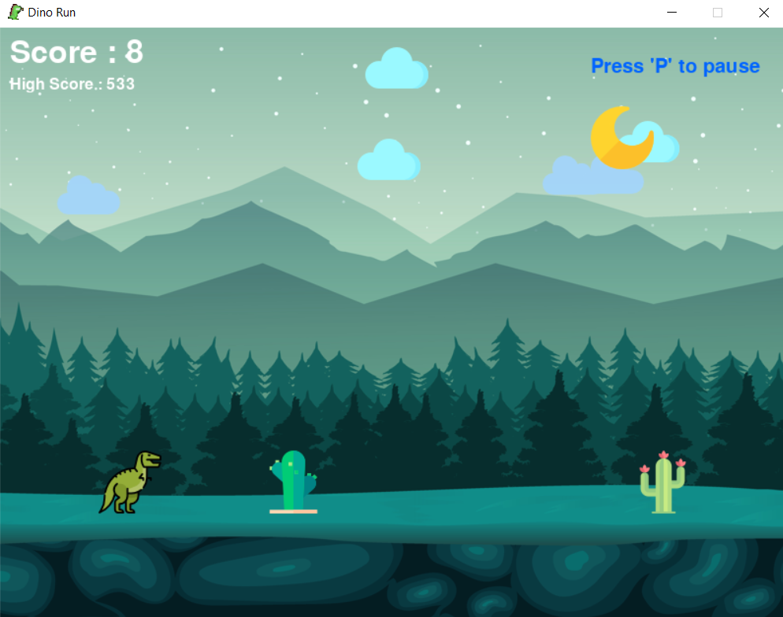
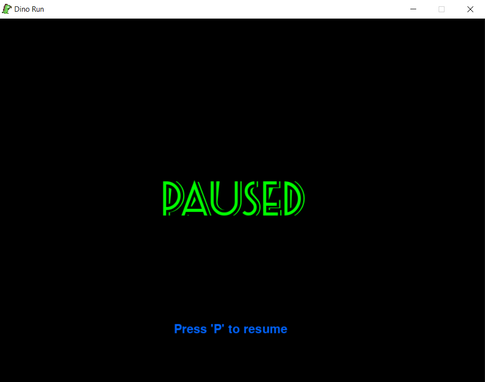
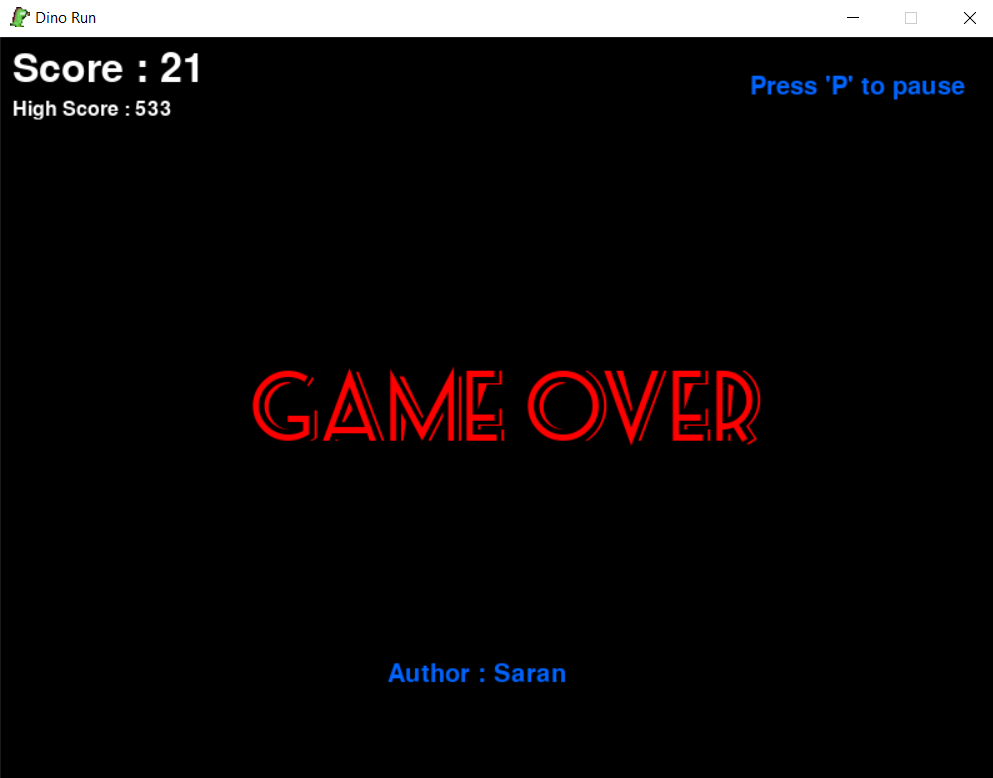

# Dino-Run
A simple and colorful dinosaur game written in python.

# Images
### Game Play

### Pause

### Game Over

# Dependencies
- [PyGame](https://pypi.org/project/pygame/)

# Instructions
- Install Python3
- Install PyGame module
- Run dino-game.py
- Press 'P' to pause the game
- If its a "GAME-OVER" close and run the game again

# Author 
- Saran
